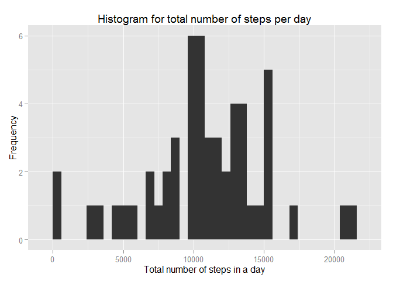
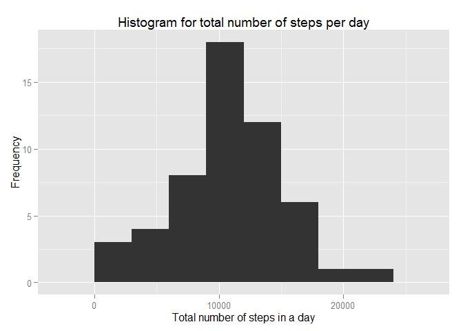
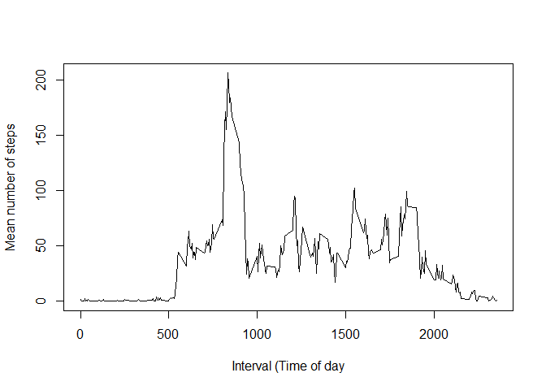
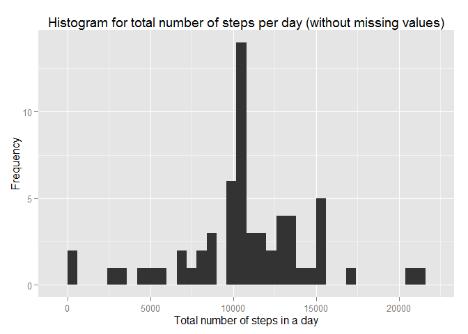
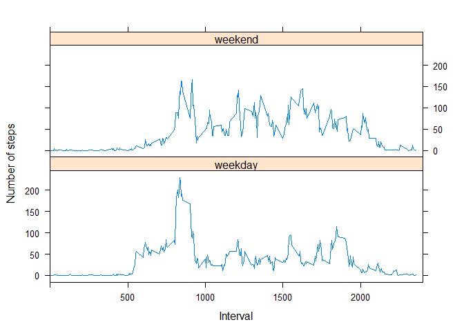

# Loading and preprocessing the data  
First, I load the packages, and change the language of my Rconsole to English, then read the table.  

```r
library(lattice)
library(ggplot2)
```

```
## Warning: package 'ggplot2' was built under R version 3.5.1
```

```r
Sys.setlocale("LC_TIME", "English")
```

```
## [1] "English_United States.1252"
```

```r
rawtable<-read.table("activity.csv",sep=",",header=T, colClasses=c("numeric","Date","numeric"))
```


# What is mean total number of steps taken per day?  
After aggregating the data, I use the qplot function of the ggplot2 package.  

```r
rawtable_aggr_sum<-aggregate(steps~date,rawtable,sum)
qplot(rawtable_aggr_sum$steps,geom="histogram",
      binwidth =600,
      main = "Histogram for total number of steps per day",
      xlab = "Total number of steps in a day",
      ylab="Frequency")
```

<!-- -->

We can also modify this plot to look more familiar:  

```r
qplot(rawtable_aggr_sum$steps,geom="histogram",
      binwidth =3000,
      main = "Histogram for total number of steps per day",
      xlab = "Total number of steps in a day",
      ylab="Frequency")
```

<!-- -->

1. The **mean** value of total number of steps taken per day is:  

```r
mean(rawtable_aggr_sum$steps,na.rm=T)
```

```
## [1] 10766.19
```

2. The **median** value of total number of steps taken per day is:  

```r
median(rawtable_aggr_sum$steps,na.rm=T)
```

```
## [1] 10765
```

  
# What is the average daily activity pattern?
1. Time series plot  

```r
rawtable_aggr_mean<-aggregate(steps~interval,rawtable,mean)
plot(rawtable_aggr_mean$interval,rawtable_aggr_mean$steps,
     type='l',
     xlab="Interval (Time of day",
     ylab="Mean number of steps")
```

<!-- -->

2. Which 5-minute interval, on average across all the days in the dataset, contains the maximum number of steps?  

```r
rawtable_aggr_mean[which.max(rawtable_aggr_mean$steps),"interval"]
```

```
## [1] 835
```
As written above interval 835 has the highest number of steps. So between 8:30 and 8:35 or between 8:35 and 8:40. (It is not clear whether the name of the internal signs the beginning or the end of the 5 minutes interval, but I would vote for between 8:35 and 8:40.)


# Imputing missing values
1. Total number of missing values:  

```r
sum(is.na(rawtable$steps))
```

```
## [1] 2304
```
2. I filled in all of the missing values in the dataset with the mean for that 5-minute interval. 

```r
mf<-function(x){
  if (is.na(x["steps"])==TRUE){
    x["steps"]<-rawtable_aggr_mean[rawtable_aggr_mean$interval==as.numeric(x["interval"]),"steps"]
    x
  } else {x}
  }
rawtable_no_na<-t(apply(rawtable,1,mf))
rawtable_no_na<-as.data.frame(rawtable_no_na,stringsAsFactors=F)
mode(rawtable_no_na$steps)<-"numeric"
rawtable_no_na$date<-as.Date(rawtable_no_na$date,"%Y-%m-%d")
rawtable_no_na_aggr<-aggregate(steps~date,rawtable_no_na,sum)
```

We can check if we successfully removed the missing values:

```r
sum(is.na(rawtable_no_na$steps))
```

```
## [1] 0
```

3. The **mean** value of total number of steps taken per day is:  

```r
mean(rawtable_no_na_aggr$steps)
```

```
## [1] 10766.19
```

4. The **median** value of total number of steps taken per day is:  

```r
median(rawtable_no_na_aggr$steps)
```

```
## [1] 10766.19
```

5. Comparison  

```r
summary(rawtable_aggr_sum)
```

```
##       date                steps      
##  Min.   :2012-10-02   Min.   :   41  
##  1st Qu.:2012-10-16   1st Qu.: 8841  
##  Median :2012-10-29   Median :10765  
##  Mean   :2012-10-30   Mean   :10766  
##  3rd Qu.:2012-11-16   3rd Qu.:13294  
##  Max.   :2012-11-29   Max.   :21194
```

```r
summary(rawtable_no_na_aggr)
```

```
##       date                steps      
##  Min.   :2012-10-01   Min.   :   41  
##  1st Qu.:2012-10-16   1st Qu.: 9819  
##  Median :2012-10-31   Median :10766  
##  Mean   :2012-10-31   Mean   :10766  
##  3rd Qu.:2012-11-15   3rd Qu.:12811  
##  Max.   :2012-11-30   Max.   :21194
```

We can see that although the mean and median are the same, but the quartile values changed slightly.  

6. Histogram of the total number of steps taken each day  

```r
qplot(rawtable_no_na_aggr$steps,geom="histogram",
      binwidth =600,
      main = "Histogram for total number of steps per day (without missing values)",
      xlab = "Total number of steps in a day",
      ylab="Frequency")
```

<!-- -->


# Are there differences in activity patterns between weekdays and weekends?  
I wanted to use weekend/weekday as a factor in xyplot with lattice package. After using weekdays(), I convert the variable to factor.  

```r
rawtable_no_na$day_type<-weekdays(rawtable_no_na$date)
rawtable_no_na$day_type<-factor(rawtable_no_na$day_type)
levels(rawtable_no_na$day_type) = list(weekday=c("Monday","Tuesday","Wednesday","Thursday","Friday"),
    weekend=c("Saturday","Sunday"))
rawtable_no_na_aggr2<-aggregate(steps~interval*day_type,rawtable_no_na,mean)
xyplot(steps ~ interval | rawtable_no_na_aggr2$day_type, data = rawtable_no_na_aggr2,
       #index.cond=list(c(2,1)),
       type="l",
       xlim=c(0,2400),
       layout=c(1,2),
       xlab="Interval",
       ylab="Number of steps")
```

<!-- -->

If we look at the two plots, we can see, that on the weekends people tend to start moving later, but also stay active longer.  
  
Comparing activity patterns between weekdays and weekends:
If we check the normality of distribution, we can see, that it's not normal distribution.  

```r
weekday<-rawtable_no_na_aggr2[rawtable_no_na_aggr2$day_type=="weekday","steps"]
weekend<-rawtable_no_na_aggr2[rawtable_no_na_aggr2$day_type=="weekend","steps"]
shapiro.test(weekday)
```

```
## 
## 	Shapiro-Wilk normality test
## 
## data:  weekday
## W = 0.77778, p-value < 2.2e-16
```

```r
shapiro.test(weekend)
```

```
## 
## 	Shapiro-Wilk normality test
## 
## data:  weekend
## W = 0.87989, p-value = 2.937e-14
```
Now, if we compare weekends and weekdays, we find no significant difference:

```r
wilcox.test(weekday,weekend)
```

```
## 
## 	Wilcoxon rank sum test with continuity correction
## 
## data:  weekday and weekend
## W = 38376, p-value = 0.121
## alternative hypothesis: true location shift is not equal to 0
```
Now, if we compare the just morning hours (5:00-9:00) of the weekends and weekdays, we might find significant difference:  

```r
weekday05_09<-rawtable_no_na_aggr2[as.numeric(rawtable_no_na_aggr2$interval) %in% c(500:900) & rawtable_no_na_aggr2$day_type=="weekday","steps"]
weekend05_09<-rawtable_no_na_aggr2[as.numeric(rawtable_no_na_aggr2$interval) %in% c(500:900) & rawtable_no_na_aggr2$day_type=="weekend","steps"]
wilcox.test(weekday05_09,weekend05_09)
```

```
## Warning in wilcox.test.default(weekday05_09, weekend05_09): cannot compute
## exact p-value with ties
```

```
## 
## 	Wilcoxon rank sum test with continuity correction
## 
## data:  weekday05_09 and weekend05_09
## W = 1710.5, p-value = 0.0002945
## alternative hypothesis: true location shift is not equal to 0
```


# Conclusion:  
To answer the question **"Are there differences in activity patterns between weekdays and weekends?"** more sophisticated stastical methods are needed (because of the timer series nature of the data).  
I just wanted to have quick look at the data, but I am sure wilcoxon test is absolutely not the adequate method for analysing this type of data.
